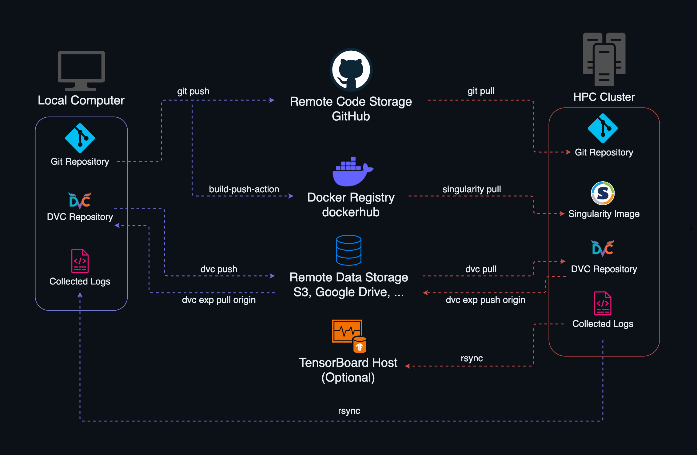

<!--
Copyright 2024 tu-studio
This file is licensed under the Apache License, Version 2.0.
See the LICENSE file in the root of this project for details.
-->

# HPC-Cluster-ML-Workflow 
This template provides a structured workflow tailored for audio machine learning research on the [HPC Cluster of ZECM at TU Berlin](https://www.tu.berlin/campusmanagement/angebot/high-performance-computing-hpc). It was developed for projects that require continuous management of multiple experiments to ensure high reproducibility and reliability of results. By incorporating tools such as DVC, Docker, and TensorBoard, the template not only enhances reproducibility but also provides a robust framework for effective collaboration and seamless sharing of experiments.

## Features
- **Reproducible Experiments**:
  - Tracks all dependencies, configurations, and artifacts to ensure experiments can be easily reproduced and shared.
  - Uses containerization to maintain consistency across different systems.
- **Resource Optimization**:
  - Reuses unchanged stages to avoid redundant computations, speeding up workflows and conserving resources.
- **Automation**:
  - Reduces manual tasks through automated builds, data pipelines, and syncing, allowing you to focus on research.
- **HPC Integration**:
  - Extends DVC for multi-node parallel experiments, optimizing HPC resource utilization.
  - Supports Docker for development, with automated conversion to Singularity for seamless HPC deployment.
- **TensorBoard Integration**:
  - Provides visualization and comparison of DVC experiments with audio logging support of TensorBoard.
  - Enables real-time monitoring and quick decisions on underperforming runs.
  
## Overview
The table below summarizes the key tools involved in the HPC-Cluster-ML-Workflow, detailing their primary roles and providing links to their official documentation for further reference.

<table align="center" style="width: 60%; border-collapse: collapse;">
  <tr>
    <th>Tool</th>
    <th>Role</th>
    <th>Documentation</th>
  </tr>
  <tr>
    <td><b>Git</b></td>
    <td>Version control for code.</td>
    <td><a href="https://git-scm.com/doc">Git Docs</a></td>
  </tr>
  <tr>
    <td><b>DVC</b></td>
    <td>Data version control and pipeline management.</td>
    <td><a href="https://dvc.org/doc">DVC Docs</a></td>
  </tr>
  <tr>
    <td><b>TensorBoard</b></td>
    <td>DVC experiment visualization and monitoring.</td>
    <td><a href="https://www.tensorflow.org/tensorboard">TensorBoard Docs</a></td>
  </tr>
  <tr>
    <td><b>Docker</b></td>
    <td>Containerization for development, converted to Singularity for HPC.</td>
    <td><a href="https://docs.docker.com">Docker Docs</a></td>
  </tr>
  <tr>
    <td><b>Singularity</b></td>
    <td>HPC-compatible containerization tool.</td>
    <td><a href="https://docs.sylabs.io">Singularity Docs</a></td>
  </tr>
  <tr>
    <td><b>SLURM</b></td>
    <td>Job scheduling and workload management on the HPC-Cluster.</td>
    <td><a href="https://slurm.schedmd.com/documentation.html">SLURM Docs</a></td>
  </tr>
</table>

### System Transfer
The figure below offers a simplified overview of how data is transferred between systems. While some of the commands depicted are automated by the provided workflows, the visualization is intended for comprehension and not as a direct usage reference.
        

        
        

## Prerequisites
- macOS, Windows or Linux operating system.
- Access to an HPC Cluster with SLURM-sheduler.
- Local Python installation.
- Familiarity with Git, DVC, and Docker.
- Docker Hub account.

## Setup 
Follow the setup instructions below for step-by-step guidance on configuring this template repository, which offers a basic PyTorch project that you can customize, reuse, or reference for your pipeline implementation.

- [Setup Instructions](docs/SETUP.md)

## Usage
Once the setup is complete, you can begin using the setup by referring to the User Guide provided. This guide will help you to understand how to develop, initiate experiments and monitor your training processes.

- [User Guide](docs/USAGE.md)

## Contributors
- [Michael Witte](https://github.com/michaelwitte)
- [Fares Schulz](https://github.com/faressc)
- [Maxime Hubert](https://github.com/jaimecomprendre)

## License
This project is licensed under the Apache License, Version 2.0. See the [LICENSE](LICENSE). 

## References
**Schulz, F. [faressc]. (n.d.). *Guitar LSTM* [pytorch-version]. GitHub. [Link](https://github.com/faressc/GuitarLSTM/tree/main/pytorch-version)**
